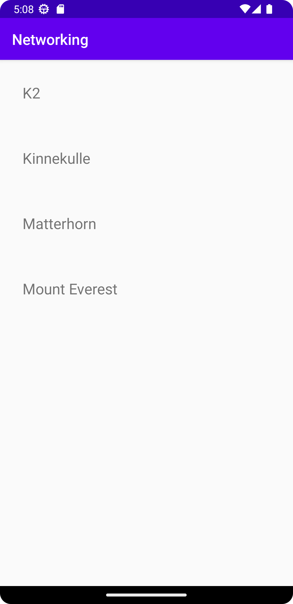

# Rapport
Started with changing gradle versions otherwise recycleView wouldn't work, and adding internet access to manifest. 
Added new classes for Mountain and RecyclerViewAdapter and the code they need to function. Added recyclerView to main xml. 
Then added ArrayList of mountains and reference to recyclerView and RecyclerViewAdapter to MainActivity.java.
Also replaced the JSON_URL with the correct string, and made a new JsonTask to execute it in onCreate.
In onPostExecute GSON was used to fill the list of mountains, which is then used to create text items with the mountain names.
had some problems with NotifyDataSetChanged, as item.getName() kept being NULL, but after a while figure out it couldn't find the right object and it was fixed.
Then moved the setAdapter to the end of that method, otherwise K2 wont show and I am not sure why.


```
   
    <uses-permission android:name="android.permission.INTERNET" />
    
------|

public class MainActivity extends AppCompatActivity implements JsonTask.JsonTaskListener {

    private final String JSON_URL = "https://mobprog.webug.se/json-api?login=brom";
    private final String JSON_FILE = "mountains.json";

    private ArrayList<Mountain> mountainsList = new ArrayList<>();
    private RecyclerView recyclerView;
    private RecyclerView.Adapter adapter;
    
    @Override
    protected void onCreate(Bundle savedInstanceState) {
        super.onCreate(savedInstanceState);
        setContentView(R.layout.activity_main);

        new JsonFile(this, this).execute(JSON_FILE);
        new JsonTask(this).execute(JSON_URL);
        
    }

    @Override
    public void onPostExecute(String json) {
        Log.d("MainActivity", json);

        Gson gson = new Gson();
        Type type = new TypeToken<List<Mountain>>() {}.getType();
        mountainsList = gson.fromJson(json, type);

        adapter = new RecyclerViewAdapter(this, mountainsList, new RecyclerViewAdapter.OnClickListener() {
            @Override
            public void onClick(Mountain item) {
                Toast.makeText(MainActivity.this, item.getName(), Toast.LENGTH_SHORT).show();
            }
        });
        
        adapter.notifyDataSetChanged();

        recyclerView = findViewById(R.id.recyclerview);
        recyclerView.setLayoutManager(new LinearLayoutManager(this));
        recyclerView.setAdapter(adapter);
        
    }

}

------|

package com.example.networking;

import android.content.Context;
import android.view.LayoutInflater;
import android.view.View;
import android.view.ViewGroup;
import android.widget.TextView;

import java.util.List;

import androidx.annotation.NonNull;
import androidx.recyclerview.widget.RecyclerView;

public class RecyclerViewAdapter extends RecyclerView.Adapter<RecyclerViewAdapter.ViewHolder> {

    private List<Mountain> items;
    private LayoutInflater layoutInflater;
    private OnClickListener onClickListener;

    RecyclerViewAdapter(Context context, List<Mountain> items, OnClickListener onClickListener) {
        this.layoutInflater = LayoutInflater.from(context);
        this.items = items;
        this.onClickListener = onClickListener;
    }

    @Override
    @NonNull
    public ViewHolder onCreateViewHolder(@NonNull ViewGroup parent, int viewType) {
        return new ViewHolder(layoutInflater.inflate(R.layout.linearlayout, parent, false));
    }

    @Override
    public void onBindViewHolder(ViewHolder holder, int position) {
        holder.title.setText(items.get(position).getName());
    }

    @Override
    public int getItemCount() {
        return items.size();
    }

    public class ViewHolder extends RecyclerView.ViewHolder implements View.OnClickListener {
        TextView title;

        ViewHolder(View itemView) {
            super(itemView);
            itemView.setOnClickListener(this);
            title = itemView.findViewById(R.id.title);
        }

        @Override
        public void onClick(View view) {
            onClickListener.onClick(items.get(getAdapterPosition()));
        }
    }

    public interface OnClickListener {
        void onClick(Mountain item);
    }
}

------|

package com.example.networking;

public class Mountain {
    private String name;
    private String location;
    private int height;


    public Mountain(){
        name="Saknar namn";
        location="Saknar plats";
        height=1;
    }

    public Mountain(String n, String l, int h){
        name=n;
        location=l;
        height=h;

    }

    public String info(){
        String tmp=new String();
        tmp+=name+" is located in mountain range " +location+ " and reaches "+height+"m above sea level.";
        return tmp;
    }

    public void setName(String n){
        name = n;
    }

    public String getName(){
        return name;
    }

    @Override
    public String toString(){
        return name;
    }
    
}

------|

   <androidx.recyclerview.widget.RecyclerView
        android:id="@+id/recyclerview"
        android:layout_width="match_parent"
        android:layout_height="match_parent"
        app:layout_constraintBottom_toBottomOf="parent"
        app:layout_constraintEnd_toEndOf="parent"
        app:layout_constraintStart_toStartOf="parent"
        app:layout_constraintTop_toTopOf="parent" />
        
------|

<?xml version="1.0" encoding="utf-8"?>
<LinearLayout xmlns:android="http://schemas.android.com/apk/res/android"
    android:layout_width="match_parent"
    android:layout_height="wrap_content"
    android:orientation="horizontal"
    android:padding="30dp">

    <TextView
        android:id="@+id/title"
        android:layout_width="wrap_content"
        android:layout_height="match_parent"
        android:layout_weight="1"
        android:text="TextView"
        android:textSize="20dp" />

</LinearLayout>

```




